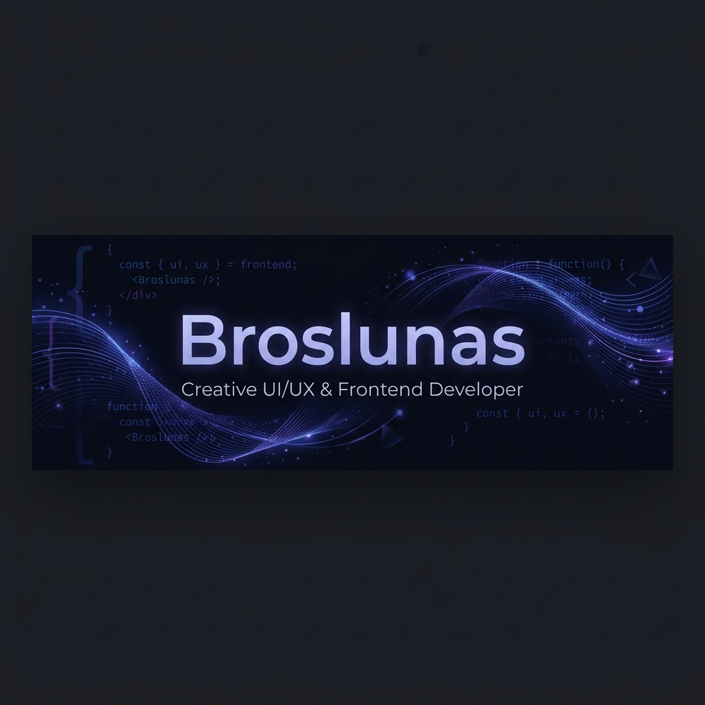

  

  
  
  

    📍 Basado en España
  

  

    Me especializo en diseñar y desarrollar aplicaciones web modernas, rápidas y escalables de extremo a extremo (Full-stack). Actualmente enfocado en el ecosistema de <b>React</b>, <b>Next.js</b>, <b>Node.js</b> y explorando el potencial de <b>Astro</b>.
  

---

### 🛠️ Tecnologías y Herramientas

<table width="100%" border="0" cellpadding="0" cellspacing="0">
  <tr>
    <td width="33%" valign="top">
      <strong>⚡ Core Frontend</strong>
      <ul>
        <li>HTML5 / CSS3</li>
        <li>JavaScript (ES6+)</li>
        <li>TypeScript</li>
      </ul>
    </td>
    <td width="33%" valign="top">
      <strong>🚀 Frameworks</strong>
      <ul>
        <li>React / Next.js</li>
        <li>Astro</li>
        <li>Node.js</li>
      </ul>
    </td>
    <td width="34%" valign="top">
      <strong>🎨 Diseño y Herramientas</strong>
      <ul>
        <li>Figma</li>
        <li>Git / GitHub</li>
        <li>UI/UX & Performance</li>
      </ul>
    </td>
  </tr>
</table>

 

  
  
  
  
  
  
  
  
  
  

---

### 🚀 Proyectos Destacados
<!-- projects:start -->
<table width="100%" cellpadding="0" cellspacing="0" style="border-collapse: collapse; margin-bottom: 20px; border: 1px solid #30363d; border-radius: 10px; overflow: hidden; background: #0d1117;">
  <tr>
    <td width="5" bgcolor="#bc52ee" style="padding: 0px;"></td>
    <td style="padding: 20px;">
      <table width="100%" border="0" cellpadding="0" cellspacing="0">
        <tr>
          <td valign="top">
            <h3><a href="https://broslunas.com/projects/impresoras-veredillasfm/" target="_blank" style="color: #bc52ee; text-decoration: none;">🚀 VeredillasFM Impresiones 3D</a></h3>
            
📅 <strong>06/04/2026</strong>

            
Infraestructura de micro-servicios para la gestión de impresión 3D bajo demanda, integrada con el ecosistema Veredillas FM y automatizada mediante ...

          </td>
          <td width="160" align="right" valign="middle" style="padding-left: 20px;">
            
          </td>
        </tr>
      </table>
    </td>
  </tr>
</table>
<table width="100%" cellpadding="0" cellspacing="0" style="border-collapse: collapse; margin-bottom: 20px; border: 1px solid #30363d; border-radius: 10px; overflow: hidden; background: #0d1117;">
  <tr>
    <td width="5" bgcolor="#bc52ee" style="padding: 0px;"></td>
    <td style="padding: 20px;">
      <table width="100%" border="0" cellpadding="0" cellspacing="0">
        <tr>
          <td valign="top">
            <h3><a href="https://broslunas.com/projects/cms/" target="_blank" style="color: #bc52ee; text-decoration: none;">🚀 Broslunas CMS</a></h3>
            
📅 <strong>07/02/2026</strong>

            
Descubre Broslunas CMS, el revolucionario sistema de gestión de contenidos para Astro. Simplifica la creación de contenidos, automatiza las impleme...

          </td>
          <td width="160" align="right" valign="middle" style="padding-left: 20px;">
            
          </td>
        </tr>
      </table>
    </td>
  </tr>
</table>
<table width="100%" cellpadding="0" cellspacing="0" style="border-collapse: collapse; margin-bottom: 20px; border: 1px solid #30363d; border-radius: 10px; overflow: hidden; background: #0d1117;">
  <tr>
    <td width="5" bgcolor="#bc52ee" style="padding: 0px;"></td>
    <td style="padding: 20px;">
      <table width="100%" border="0" cellpadding="0" cellspacing="0">
        <tr>
          <td valign="top">
            <h3><a href="https://broslunas.com/projects/veredillasfm/" target="_blank" style="color: #bc52ee; text-decoration: none;">🚀 Veredillas FM</a></h3>
            
📅 <strong>31/01/2026</strong>

            
La plataforma oficial de podcast y radio digital del IES Veredillas. Ecosistema digital completo con streaming, gestión de comunidad y automatizaci...

          </td>
          <td width="160" align="right" valign="middle" style="padding-left: 20px;">
            
          </td>
        </tr>
      </table>
    </td>
  </tr>
</table>
<!-- projects:end -->

---

### 📝 Últimos Artículos
<!-- blog:start -->
<table width="100%" cellpadding="0" cellspacing="0" style="border-collapse: collapse; margin-bottom: 20px; border: 1px solid #30363d; border-radius: 10px; overflow: hidden; background: #0d1117;">
  <tr>
    <td width="5" bgcolor="#38bdf8" style="padding: 0px;"></td>
    <td style="padding: 20px;">
      <table width="100%" border="0" cellpadding="0" cellspacing="0">
        <tr>
          <td valign="top">
            <h3><a href="https://broslunas.com/blog/lanzamiento-impresoras-veredillasfm/" target="_blank" style="color: #38bdf8; text-decoration: none;">📝 ¡Lanzamos VeredillasFM Impresiones 3D!</a></h3>
            
📅 <strong>06/04/2026</strong>

            
Ampliamos el ecosistema de Veredillas FM con un nuevo servicio de impresión 3D para toda la comunidad educativa del IES Las Veredillas.

          </td>
          <td width="160" align="right" valign="middle" style="padding-left: 20px;">
            
          </td>
        </tr>
      </table>
    </td>
  </tr>
</table>
<table width="100%" cellpadding="0" cellspacing="0" style="border-collapse: collapse; margin-bottom: 20px; border: 1px solid #30363d; border-radius: 10px; overflow: hidden; background: #0d1117;">
  <tr>
    <td width="5" bgcolor="#38bdf8" style="padding: 0px;"></td>
    <td style="padding: 20px;">
      <table width="100%" border="0" cellpadding="0" cellspacing="0">
        <tr>
          <td valign="top">
            <h3><a href="https://broslunas.com/blog/broslunas-cms/" target="_blank" style="color: #38bdf8; text-decoration: none;">📝 Broslunas CMS: El Futuro de la Gestión de Contenido para Astro</a></h3>
            
📅 <strong>07/02/2026</strong>

            
Descubre Broslunas CMS, el sistema de gestión de contenido diseñado para simplificar la creación y gestión de sitios web y aplicaciones Astro. Inte...

          </td>
          <td width="160" align="right" valign="middle" style="padding-left: 20px;">
            
          </td>
        </tr>
      </table>
    </td>
  </tr>
</table>
<table width="100%" cellpadding="0" cellspacing="0" style="border-collapse: collapse; margin-bottom: 20px; border: 1px solid #30363d; border-radius: 10px; overflow: hidden; background: #0d1117;">
  <tr>
    <td width="5" bgcolor="#38bdf8" style="padding: 0px;"></td>
    <td style="padding: 20px;">
      <table width="100%" border="0" cellpadding="0" cellspacing="0">
        <tr>
          <td valign="top">
            <h3><a href="https://broslunas.com/blog/lanzamiento-veredillasfm/" target="_blank" style="color: #38bdf8; text-decoration: none;">📝 Veredillas FM: Reinventando la radio de tu insti</a></h3>
            
📅 <strong>31/01/2026</strong>

            
Te presento la nueva web de Veredillas FM. Mucho más que escuchar podcasts: chat en directo, noticias y una comunidad para todos.

          </td>
          <td width="160" align="right" valign="middle" style="padding-left: 20px;">
            
          </td>
        </tr>
      </table>
    </td>
  </tr>
</table>
<!-- blog:end -->

---

### 🎓 Certificaciones Recientes
<!-- certs:start -->
<table width="100%" border="0" cellpadding="0" cellspacing="0"><tr><td align="center" valign="top" width="33%" style="padding: 10px;"><table width="100%" style="border-collapse: collapse; border: 1px solid #30363d; border-radius: 10px; background-color: #0d1117;"><tr><td align="center" style="padding: 20px 10px;">  <strong style="color: #adbac7; font-size: 0.9em; display: block; min-height: 40px; line-height: 1.3;">Desarrollo Web con IA</strong> 📅 21/05/2026</td></tr></table></td><td align="center" valign="top" width="33%" style="padding: 10px;"><table width="100%" style="border-collapse: collapse; border: 1px solid #30363d; border-radius: 10px; background-color: #0d1117;"><tr><td align="center" style="padding: 20px 10px;">  <strong style="color: #adbac7; font-size: 0.9em; display: block; min-height: 40px; line-height: 1.3;">Introducción a la IA para Developers</strong> 📅 20/05/2026</td></tr></table></td><td align="center" valign="top" width="33%" style="padding: 10px;"><table width="100%" style="border-collapse: collapse; border: 1px solid #30363d; border-radius: 10px; background-color: #0d1117;"><tr><td align="center" style="padding: 20px 10px;">  <strong style="color: #adbac7; font-size: 0.9em; display: block; min-height: 40px; line-height: 1.3;">Google Cybersecurity</strong> 📅 19/09/2025</td></tr></table></td></tr><tr><td align="center" valign="top" width="33%" style="padding: 10px;"><table width="100%" style="border-collapse: collapse; border: 1px solid #30363d; border-radius: 10px; background-color: #0d1117;"><tr><td align="center" style="padding: 20px 10px;">  <strong style="color: #adbac7; font-size: 0.9em; display: block; min-height: 40px; line-height: 1.3;">Figma Desde 0</strong> 📅 16/07/2025</td></tr></table></td><td align="center" valign="top" width="33%" style="padding: 10px;"><table width="100%" style="border-collapse: collapse; border: 1px solid #30363d; border-radius: 10px; background-color: #0d1117;"><tr><td align="center" style="padding: 20px 10px;">  <strong style="color: #adbac7; font-size: 0.9em; display: block; min-height: 40px; line-height: 1.3;">CSS Desde 0</strong> 📅 12/07/2025</td></tr></table></td><td align="center" valign="top" width="33%" style="padding: 10px;"><table width="100%" style="border-collapse: collapse; border: 1px solid #30363d; border-radius: 10px; background-color: #0d1117;"><tr><td align="center" style="padding: 20px 10px;">  <strong style="color: #adbac7; font-size: 0.9em; display: block; min-height: 40px; line-height: 1.3;">HTML desde 0</strong> 📅 11/07/2025</td></tr></table></td></tr></table>
<!-- certs:end -->

---

### 📈 GitHub Dashboard

  <h4>🎮 Pacman Contribution Graph (Modo Oscuro)</h4>
  

<table width="100%" border="0" cellpadding="0" cellspacing="0">
  <tr>
    <td width="50%" align="center" valign="top" style="padding: 10px;">
      
    </td>
    <td width="50%" align="center" valign="top" style="padding: 10px;">
      
    </td>
  </tr>
  <tr>
    <td colspan="2" align="center" valign="middle" style="padding: 10px;">
      
    </td>
  </tr>
</table>

  

 

  

---

### 🤝 Contacto y Apoyo

  
  

